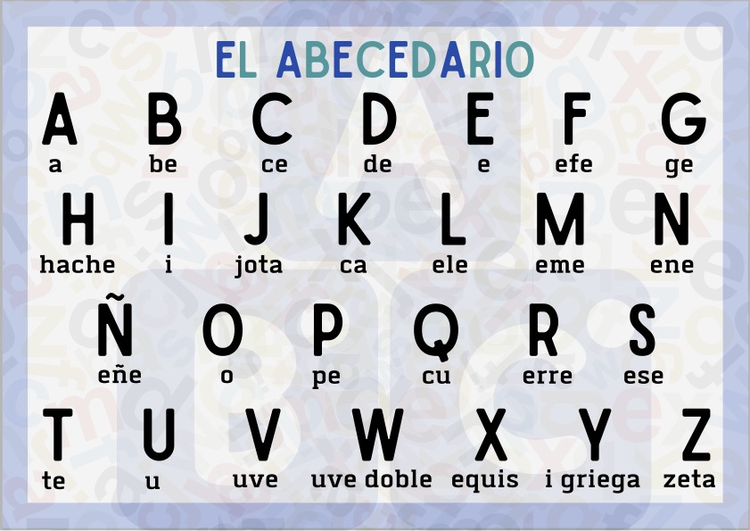
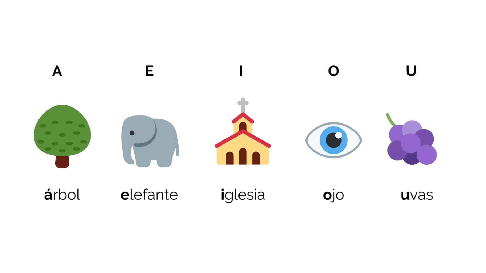
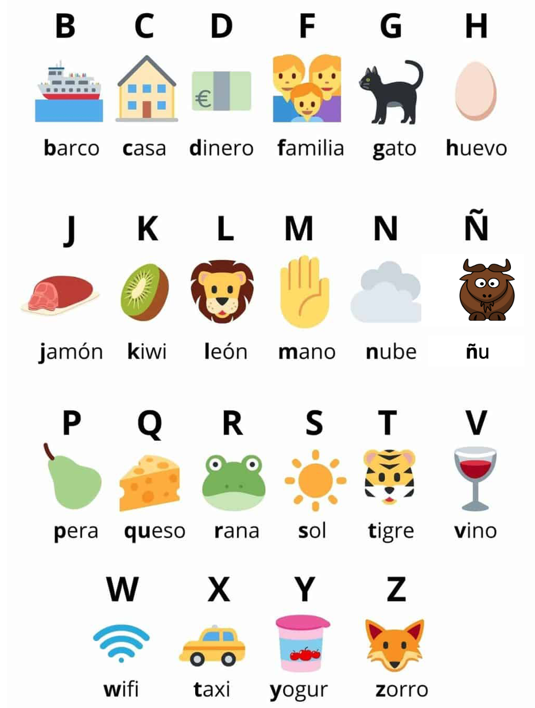
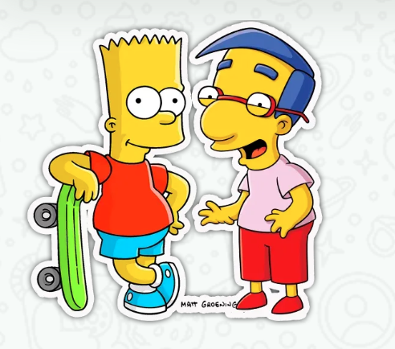

## Índice

\tableofcontents

# Introducción

## Contenido

* En esta presentación, se hará un resumen de los temas estudiados en el microcurso de Español - nivel A1.
	1. _Tema 1_: El alfabeto. La base de la pronunciación y escritura en español.
	2. _Tema 2_: Saludos, despedidas y presentaciones. Cómo interactuar y presentarse en situaciones sociales.
		- _Gestos culturales_: ¿Cómo se saludan o despiden los españoles?
	3. _Tema 3_: Las emociones. Vocabulario esencial para expresar sentimientos y estados de ánimo.

# Tema 1: El alfabeto


## El alfabeto

* El alfabeto en español consta de 27 letras, incluyendo la "ñ". Es importante aprender la pronunciación correcta de cada letra, para ello, haz uso de las videolecciones del microcurso.

\centering

{width=50% }\


## Las letras del alfabeto

* **Vocales:**
	- A - E - I - O - U

* **Consonantes**
	- B, C, D, F, G, H, J, K, L, M, N, Ñ, P, Q, R, S, T, V, W, X, Y, Z.


## Las letras del alfabeto: vocabulario

* Repasa el vocabulario:

\vspace{0.3cm}

\centering

{ width=35% }\ { width=30% }\

# Tema 2: Saludos, despedidas y presentaciones


## Saludos y despedidas

* En español, hay varias maneras de **saludar** y **despedirse**. Aquí hay algunos ejemplos:

### Formales:

::: {.columns}

:::: {.column }

* **Saludos:**
	- Hola
 	- Buenos días
 	- Buenas tardes
	- Buenas noches

::::


:::: {.column }


\vspace{0.4cm}

* **Despedidas:**
	- Adiós
	- Hasta luego
	- Hasta pronto


:::: 

:::


## Informales:

::: {.columns}

:::: {.column }


* **Saludos:**
	- Hey
 	- Buenas
 	- ¿Qué hay?

::::


:::: {.column }


\vspace{0.4cm}

* **Despedidas:**
	- Chao
	- Te veo luego
	- Cuídate

:::: 

:::


## Presentaciones

Al presentarse, es común usar expresiones como:

* **Para preguntar el nombre:**
	- ¿Cómo[^1] te llamas? (tú)/ ¿Cómo se llama? (usted)
	- ¿Cuál es tu nombre? (tú)/ ¿Cuál es su nombre? (usted)

* **Para responder:**
	- Me llamo [nombre]. / Mi nombre es [nombre]. (Example: *My name is* Maria)

* **Ejemplo:**
	- Hola, me llamo María. Soy de Brasil. Soy profesora y trabajo en el Instituto Cervantes. Tengo 23 años y me gusta caminar en la playa todos los días.

[^1]: [Pronombres interrogativos](https://www.ejemplos.co/pronombres-interrogativos/#ixzz8anHqlyy3): Los pronombres interrogativos son aquellos pronombres que reemplazan un sujeto con la intención de preguntar. Se utilizan para hacer una interrogación vinculada a un referente. Por ejemplo: quién, qué, cuál. **Para saber más:** [Pronombres interrogativos](https://www.ejemplos.co/pronombres-interrogativos/#ixzz8anHqlyy3).

## Ejemplo de un diálogo informal: 

* Diálogo entre amigos:

	- Daniel: Hola, Ricardo, ¿cómo estás? ¡Bien! Hace mucho que no te veía…
	- Ricardo: Hola, Daniel, estoy bien, ¿tú qué tal? Es que me fui de viaje. Volví ayer. Lo pasé increíble.
	- Daniel: ¡Cuánto me alegra! Envíale mis saludos a tu madre. Cuídate
	- Ricardo: Igualmente, ¡chao!

\centering

{ width=30% }\

## Ejemplo de un diálogo formal:

* Diálogo entre una profesora y los alumnos:

	- Profesora: Buenos días. Soy María Bonfim, vuestra profesora de español.
	- Alumnos: Buenos días.
	- Alumno: Disculpe, profesora. Soy Marcos Domínguez, hoy debo irme antes por una consulta médica.
	- Profesora: Por supuesto, Domínguez. Nos veremos en la próxima semana.
	- Alumno: Muchas gracias. Hasta pronto.
	- Profesora: ¡Hasta luego!

\centering

{ width=45% }\

# Gestos culturales

## ¿Cómo se saludan o despiden los españoles?

### Ambiente formal

- **Dar la mano:** 
  - Común en ambientes laborales, académicos e institucionales.
  - Se utiliza al ser presentado a alguien por primera vez.

### Ambiente informal

- **Dos besos:**
  - Se da un beso en cada mejilla.
  - Indica confianza y cercanía con la otra persona.
  
- **Abrazo:**
  - Se usa entre amigos cercanos y familiares.
  - Refleja afecto y familiaridad.

- **Chocar las manos:**
  - Común entre los más jóvenes.

# Tema 3: Las Emociones

## ¿Por qué aprenderse vocabulario relacionado con las emociones?

Las emociones son una parte esencial del vocabulario en cualquier idioma. Recordemos las que ya hemos visto en este micro-curso:

| Emoción       | Definición                             |
|---------------|----------------------------------------|
| Contento/a    | Sentirse alegrem satisfecho            |
| Triste        | Sentirse afligido o apesadumbrado      |
| Sorprendido/a | Sentirse admirado o impactado          |
| Asustado/a    | Sentirse con miedo, espanto o pavor    |
| Aburrido/a    | Sentirse desinteresado, causa tedio    |
| Enfadado/a    | Sentirse enojado/ por algo/alguien     |
| Confuso/a     | No tener claridad en los pensamientos  |
| Orgulloso/a   | Sentirse satisfecho/ ser engreído      |
| Nervioso/a    | Sentirse intranquilo/ ansioso          |
| Preocupado/a  | Sentirse intranquilo, inquieto         |

# Indicaciones

## `Recomendaciones`

* Despreocúpate: sólo necesitas tu motivación y ganas de aprender. También necesitarás un dispositivo con conexión a Internet. Asegúrate de poder escuchar audio en tu dispositivo, será necesario para escuchar la pronunciación correcta del español.

### ¿Qué necesitas?

En este curso sobre *español para iniciantes*, no usaremos ninguna de las variables Python, tampoco necesitas saber sobre HTML, como por ejemplo:

```python
def my_function(my_list,mynumber)
```
`<h1> a <h6>`, `<strong>` o `<em>`.


# Referencias

## Bibliografía

* [Diálogo Formal e Informal – Ejemplos.co](https://www.ejemplos.co/dialogo-formal-e-informal/)
* [El Alfabeto, Abecedario, Letras y Sonidos – Arche Ele](https://arche-ele.com/el-alfabeto-abecedario-letras-y-sonidos)
* [El Alfabeto Español – Let's Speak Spanish](https://letsspeakspanish.com/es/blog/el-alfabeto-espanol/)
* [Cómo Presentarse en Español – Academia de Español](https://academia-de-espanol.com/como-presentarse-en-espanol/)
* [Pronombres Interrogativos – Ejemplos.co](https://www.ejemplos.co/pronombres-interrogativos/#ixzz8anHqlyy3)
* [Saludos y Despedidas en Español – Spanish Learning Lab](https://www.spanishlearninglab.com/saludos-y-despedidas-en-espanol/)
* [Saludos y Despedidas en Español – Berceo](https://berceo.com/es/saludos-y-despedidas-en-espanol/#:~:text=%C2%BFqu%C3%A9%20tal%3F%20%2C%20%C2%BFc%C3%B3mo,%2Fbuenas%)


