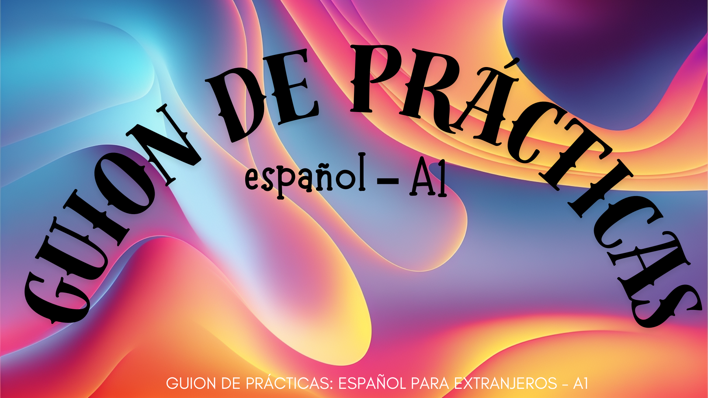
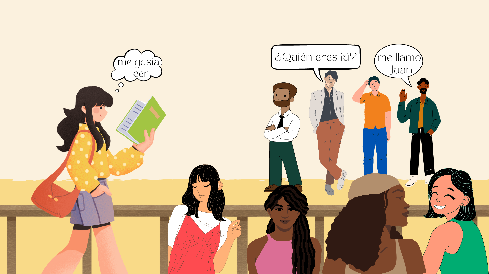

# Guion de prácticas

{width=60% }\

## Introducción

Tras la realización de este curso, habrás obtenido los conocimientos y las herramientas necesarias para presentarte de manera efectiva en español. Ahora, se te van a proponer varias actividades para poner a prueba tus habilidades y creatividad. Una vez finalizadas y entregadas, recibirás una insignia de reconocimiento por tu participación en este curso.

## Instrucciones

Se deberán realizar las siguientes tareas **antes del 15 de julio**. Cada una de ellas representa el porcentaje de trabajo individual del curso. **Se necesitan superar todas para aprobar el curso**. Debes entregarlas en la tarea abierta dentro del apartado de "Actividades", en una carpeta comprimida con el nombre de: ApellidosNombre - EspañolA1. Por ejemplo: BonfimAlvarengaMaria - EspañolA1.

**Lista de tareas**:

1. Grabar un vídeo presentándote
2. Hacer una presentación (power point o Google slides) sobre tu presentación
3. Reflexión escrita sobre el curso

## Primera tarea: Vídeo de presentación personal

Graba un vídeo presentándote en español. En este vídeo, debes incluir la siguiente información:

1. **Nombre y apellidos**
	- "Me llamo [nombre]"
	- "Mis apellidos son [apellidos]"

2. **País y Nacionalidad**
   - "Soy de [país]"
   - "Soy [nacionalidad]"

3. **Edad**
	- "Tengo [edad] años"

4. **Profesión**
   - "Soy [profesión] y trabajo/estudio en [lugar de trabajo/estudio]"

5. **Estado Civil** (opcional)
   - "Estoy [estado civil]"

6. **Idiomas o Lenguas**
   - "Hablo [idiomas que dominas]"

7. **Aficiones o Gustos**
	- "Me gusta [aficiones/gustos]."

{width=50% }\

### Ejemplo

```plaintext
Hola, me llamo María. Mi apellido es Bonfim Alvarenga. Soy de Brasil. Soy brasileña. Tengo 24 años. Soy profesora y trabajo en un instituto llamado “Instituto Cervantes”. Estoy soltera. Hablo español, inglés y portugués. Me gusta caminar en la playa todos los días.
```

Observa los siguientes ejemplos con atención, son ejemplos de presentación válidas en los que podrás inspirarte.

\

[Ejemplo de presentación: vídeo](https://www.youtube.com/watch?v=LK60fDopDBU)

[Ejemplo de presentación: audio](https://soundcloud.com/user-341216436/como-presentarseen-espanol?utm_source=clipboard&utm_medium=text&utm_campaign=social_sharing)

El vídeo **no** debe durar **más de 2 minutos**. Asegúrate de hablar claramente y de que la calidad del audio y del video sea buena. Este video será una demostración de tu capacidad para presentarte en español.

## Segunda tarea: Creación de una presentación (PowerPoint o Google Slides) sobre tu presentación

Crea una presentación de **5 diapositivas** sobre lo que hablarás en tu vídeo de presentación personal. Acuérdate de incluir los siguientes puntos:

### Saludos y Despedidas

- Incluye ejemplos de saludos según la situación (formal o informal).
- Incluye ejemplos de despedidas según la situación (formal o informal).

### Desarrolo de tu presentación

- Desarrolla tu presentación.

### Las Emociones

- Puedes incluir cómo te sientes el día de tu presentación.

* **Emoción**: Contento
* **Motivo**: ¿Te pone contento dominar tu propia presentación en español?
* **Emoción**: Nervioso
* **Motivo**: ¿Estás nervioso por presentarte y grabarte?

La presentación debe ser visualmente **atractiva y clara**. Utiliza imágenes y tablas para hacerla más comprensible. Cada diapositiva debe tener un pie de página con tu **nombre completo** y el **título del curso**.

## Tercera tarea: Reflexión Escrita

Escribe una reflexión de **no más de 1 página** sobre tu **experiencia** en este curso. Incluye los siguientes puntos:

### Lo que has aprendido

- Menciona los conocimientos y habilidades que has adquirido.

### Desafíos

- Describe los desafíos que enfrentaste y cómo los superaste.

### Aplicación en la vida real

- Explica cómo planeas utilizar lo que has aprendido en tu vida personal, académica o profesional.

## ¿Qué se va a valorar?

1. **Correcta redacción**
   - Claridad y precisión en el uso del español.

2. **Variedad de recursos y construcciones**
   - Uso de vocabulario diverso y estructuras gramaticales adecuadas según lo estudiado en el curso.

3. **Buena argumentación y claridad expositiva**
   - Coherencia y lógica en la presentación de ideas.

4. **Creatividad**
   - Originalidad y esfuerzo en la creación de contenido.

5. **Uso de material complementario**
   - Inclusión de imágenes, tablas y otros recursos visuales para enriquecer el contenido.

<iframe src="https://giphy.com/embed/l0G18nnGpVREqzees" width="480" height="366" frameBorder="0" class="giphy-embed" allowFullScreen></iframe><p><a href="https://giphy.com/gifs/season-5-the-simpsons-5x3-l0G18nnGpVREqzees">via GIPHY</a></p>

## Contacto

Para cualquier duda o preguntas, escribidme al correo: <mbonfim@ucm.com>.

Dispones de varios materiales en [DonQuijote] o en [PROFEdeELE].

 [donQuijote]: https://www.donquijote.org/es/blog/saludos-despedidas-en-espanol/       "Don QUIJOTE"
 [PROFEdeELE]:  https://www.profedeele.es/actividad/dar-pedir-informacion-personal/       "Profe de Ele"
 